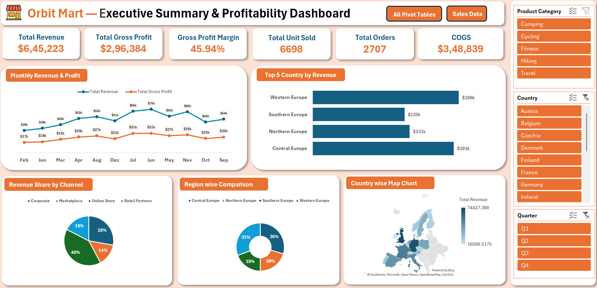

# Retail Sales & Profitability Dashboard (Excel)

An interactive Excel dashboard that turns raw retail transaction data into an executive-level view of revenue, profit, and performance by country, region, and sales channel.

> **Note:** "Orbit Mart" is a fictional company and the dataset is simulated for practice. No real company data is used.

---

## Dashboard Preview

---

## Project Overview

The dataset contains **2,707 orders** of outdoor and lifestyle products (Camping, Cycling, Fitness, Hiking, Travel) sold across European countries through four channels: Online Store, Corporate, Marketplace, and Retail Partners.

The goal was to take a raw, messy dataset through the full analyst workflow: cleaning, validation, Pivot Table analysis, and dashboard design.

---

## Key Metrics

| KPI | Value |
|---|---|
| Total Revenue | $645,223 |
| Total COGS | $348,839 |
| Total Gross Profit | $296,384 |
| Gross Profit Margin | 45.94% |
| Total Units Sold | 6,698 |
| Total Orders | 2,707 |

---

## Dashboard Features

**Visuals**
- Monthly Revenue & Gross Profit trend (line chart, Jan to Dec)
- Top 5 Countries by Revenue (bar chart)
- Revenue Share by Sales Channel (pie chart)
- Region-wise Revenue Comparison (donut chart)
- Country-wise Revenue Map (filled map chart)

**Interactivity**
- Slicers for **Product Category**, **Country**, and **Quarter**; KPI cards and charts update together
- Navigation buttons to jump to the Pivot Tables and Sales Data sheets

**Design choice:** The *Top 5 Countries* chart is intentionally independent of the Country slicer. It acts as an all-time benchmark, because filtering a "Top 5" chart down to one country would make it meaningless.

---

## Key Insights

- **Online Store** is the largest channel at 40% of revenue, followed by Corporate (28%), Retail Partners (18%), and Marketplace (14%).
- **United Kingdom** ($74k) and **Germany** ($70k) lead in revenue, followed by France, Italy, and Spain.
- **Western Europe** (31%) and **Central Europe** (30%) together generate over 60% of revenue.
- Revenue peaks in **June ($70k)** and again in **November ($66k)**; the lowest month is **February ($36k)**.
- Gross profit margin holds at roughly **46%**, indicating healthy profitability.

---

## Data Cleaning & Validation

- Removed duplicate records
- Standardized text fields (TRIM / PROPER) and date formats
- Kept missing numeric values blank instead of filling with 0, so averages and sums stay accurate
- Used an Excel Table as the Pivot source so new rows are picked up automatically
- Validated KPIs: Revenue − COGS = Gross Profit, and Gross Profit ÷ Revenue = Margin
- Cross-checked Pivot grand totals against the dashboard KPI cards

---

## Skills Demonstrated

| Area | Details |
|---|---|
| Data Cleaning | Duplicates, text standardization, date formats, missing values |
| Analysis | Pivot Tables, calculated fields, grand-total validation |
| Visualization | Line, bar, pie, donut, and map charts; custom number formats |
| Dashboard Design | KPI cards, consistent colour theme, slicers, navigation buttons |
| Troubleshooting | Slicer connections (Report Connections), independent Pivot caches, chart sorting, data label overlap |

---

## Workbook Structure

| Sheet | Description |
|---|---|
| `DashBoard` | Final dashboard with KPIs, charts, and slicers |
| `Pivot Table` | Pivot Tables that feed each chart and KPI |
| `Data` | Cleaned transactional data (2,707 rows) |

---

## How to Use

1. Download `Excel_Sales_Dashboard_3(2).xlsx` from this repository.
2. Open in Microsoft Excel (2016 or later recommended for full chart/slicer support).
3. Use the slicers on the Dashboard sheet to filter by Product Category, Country, or Quarter.
4. Navigate to `Pivot Table` or `Data` sheets using the buttons on the dashboard header to explore the underlying analysis.

---

## About This Project

This project was built as part of my self-learning journey into Data Analytics, focused on strengthening practical Excel skills — data cleaning, Pivot Tables, and dashboard design — for real-world business analysis scenarios.

**Connect with me:** linkedin.com/in/shalu-8628461aa
